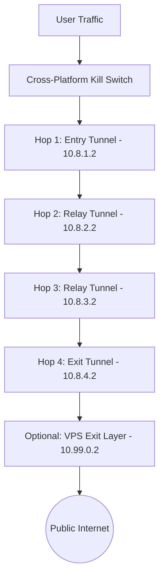

# SecureChain: Adaptive Multi-Hop Network Security Orchestrator

[](https://www.python.org/downloads/)
[]()
[](https://www.wireguard.com/)
[]()
[]()
[](LICENSE)

**SecureChain** is an adaptive multi-hop network security orchestrator. It manages nested WireGuard VPN chains (from 2 up to 10 hops) with an optional VPS termination node, enforces strict cross-platform fail-closed kill switches, provides per-hop capability-aware IPv6 routing, dynamic telemetry path selection with flapping dampening, race-hardened failure recovery, optional traffic shaping and local privacy proxy extensions, and DPAPI-backed credential encryption.

---

## Table of Contents
1. [Key Features](#1-key-features)
2. [Platform Support Matrix](#2-platform-support-matrix)
3. [Architecture Overview](#3-architecture-overview)
4. [Quick Start (One-Command Interactive Box)](#4-quick-start-one-command-interactive-box)
5. [Dual-Mode Operation: Real vs. Simulation](#5-dual-mode-operation-real-vs-simulation)
6. [Configuring Multi-Hop VPNs (2 to 10 Hops)](#6-configuring-multi-hop-vpns-2-to-10-hops)
7. [IPv6 Capability-Aware Routing](#7-ipv6-capability-aware-routing)
8. [Optional Privacy Subsystems](#8-optional-privacy-subsystems)
9. [System Readiness & Reality Doctor](#9-system-readiness--reality-doctor)
10. [Command Box Reference](#10-command-box-reference)
11. [Test Integrity & Verification Suite](#11-test-integrity--verification-suite)
12. [Threat Model & Security Boundaries](#12-threat-model--security-boundaries)
13. [Documentation Index](#13-documentation-index)

---

## 1. Key Features

- **Nested Multi-Hop Tunneling (2–10 Hops):** Sequentially encapsulates tunnels layer-by-layer ($H_1 \to H_2 \to \dots \to H_N$), automatically adjusting MTU overhead to prevent fragmentation.
- **Cross-Platform Fail-Closed Kill Switch:** Native enforcement on Windows (`netsh advfirewall`), Linux (`nftables` in isolated table `inet securechain`), and macOS (`pf` in isolated anchor `anchor "securechain"`), with automatic fallback to `VirtualKillSwitch`. Host firewall configurations outside the SecureChain namespace are never destroyed or flushed.
- **Per-Hop Capability-Aware IPv6 Routing:** Evaluates each hop's capabilities before configuring routing. Enables dual-stack split default routes (`::/1`, `8000::/1`) strictly when 100% of selected hops support IPv6; enforces fail-closed suppression (`BLOCKED_FAIL_CLOSED`) whenever any hop is IPv4-only.
- **Adaptive Path Selection with Capability Filtering:** Dynamically scores candidate paths using latency, packet loss, and jitter telemetry, with hysteresis to prevent route flapping and optional `require_ipv6` filtering.
- **Race-Hardened Recovery Engine:** Mutex-synchronized failure handling prevents reconnect races across health probe events, purges stale routes, and maintains atomic fail-closed lockdown.
- **Optional Traffic Shaping Module:** Implements discrete packet-size bucket padding (128B, 256B, 512B, 1024B, 1420B) and randomized timing jitter (0–20ms) to reduce observable burst patterns.
- **Optional Local Privacy Proxy:** Local HTTP proxy (`127.0.0.1:8118`) that strips tracking headers and normalizes User-Agent strings, featuring transparent CONNECT tunneling with zero TLS MITM interception.
- **Interactive Command Console:** Launch the tool with a single command (`python -m securechain`) and manage routing, status, and health inside an interactive session.
- **Zero Plaintext Secrets:** Sensitive keys are encrypted with Windows DPAPI (`CryptProtectData`), and logs are automatically sanitized to redact keys, tokens, and credentials.

---

## 2. Platform Support Matrix

| Platform | Native Firewall Backend | IPv4 Routing | IPv6 Routing | Kill Switch | Test Status |
|---|---|---|---|---|---|
| **Windows 10/11** | Windows Advanced Firewall (`netsh`) | Supported | Supported / Fail-Closed | Supported | UNIT + SIMULATION + REAL (Admin) |
| **Linux** | `nftables` (isolated table `inet securechain`) | Supported | Supported / Fail-Closed | Supported | UNIT + SIMULATION (CLI verified) |
| **macOS** | Packet Filter (`pf` anchor `securechain`) | Supported | Supported / Fail-Closed | Supported | UNIT + SIMULATION (CLI verified) |
| **Generic / Non-Root** | `VirtualKillSwitch` (In-memory packet barrier) | Supported (Mesh) | Supported / Fail-Closed | Supported (Virtual) | UNIT + SIMULATION (100% pass) |

---

## 3. Architecture Overview



### Routing Invariants:
- **Hop 1** is routed directly via your physical default gateway (`Ethernet`/`Wi-Fi`).
- **Hop 2** is routed strictly through the tunnel interface of **Hop 1**.
- **Hop $N$** is routed strictly through the tunnel interface of **Hop $N-1$**.
- Split default routes (`0.0.0.0/1` and `128.0.0.0/1` for IPv4; `::/1` and `8000::/1` for IPv6 when capable) bind strictly to the final exit hop.

---

## 4. Quick Start (One-Command Interactive Box)

### Prerequisites
- Windows 10/11, Linux, or macOS
- Python 3.10+
- Dependencies: `pip install typer rich pydantic pyyaml pytest psutil pywin32` (on Windows)

### Launch the Interactive Command Box
```powershell
python -m securechain
```

```text
+----------------------- SECURECHAIN COMMAND BOX -----------------------+
| SecureChain Interactive Command Console (v1.1.0)                      |
|                                                                       |
| You are inside the SecureChain command box.                           |
| Enter commands directly below without typing 'python -m securechain'. |
| Type help for available commands, or exit to leave.                   |
+-----------------------------------------------------------------------+

SecureChain> doctor
SecureChain> start --mode simulation --hops 3
SecureChain> status
SecureChain> health
SecureChain> routes
SecureChain> paths
SecureChain> stop
SecureChain> exit
```

---

## 5. Dual-Mode Operation: Real vs. Simulation

| Mode | Real Network Mode (`--mode real`) | Simulation Mode (`--mode simulation`) |
|---|---|---|
| **Purpose** | Live physical network encryption | Testing, development, CI/CD |
| **Privileges** | Requires elevated prompt (Admin / root) | Runs as normal unprivileged user |
| **External Servers** | Requires real WireGuard endpoints | Zero external servers needed |
| **OS Network Stack** | Updates host routes & native firewall | Runs in in-memory `VirtualNetworkMesh` |
| **Traffic Protected** | **YES (Real OS traffic encrypted)** | **NO (Simulation mesh only)** |

---

## 6. Configuring Multi-Hop VPNs (2 to 10 Hops)

SecureChain supports anywhere from **2 up to 10 hops**:

```powershell
python -m securechain configure-network --hops 3
```

This generates WireGuard configuration templates in `.wireguard_configs/`:
- `.wireguard_configs/hop-01.conf` (Entry, MTU 1420)
- `.wireguard_configs/hop-02.conf` (Relay, MTU 1400)
- `.wireguard_configs/hop-03.conf` (Exit, MTU 1380)

---

## 7. IPv6 Capability-Aware Routing

SecureChain avoids the dangerous pitfall of silently routing IPv6 traffic into an IPv4-only intermediate tunnel:
- **Full Capability**: If all hops report `supports_ipv6 = True`, dual-stack routing is activated with split default routes (`::/1`, `8000::/1`) via the exit tunnel.
- **Mixed Capability**: If any intermediate node is IPv4-only, IPv6 is forced into `BLOCKED_FAIL_CLOSED` mode on physical adapters, preventing side-channel leakage.
- **Requirement Enforcement**: When `path_selection.require_ipv6: true` is configured, candidate paths containing IPv4-only nodes are automatically rejected.

---

## 8. Optional Privacy Subsystems

### Traffic Shaping & Packet Padding
Configurable under `privacy.traffic_shaping` in `config.yaml` (disabled by default):
- **Modes**: `low`, `balanced`, `high`.
- **Padding**: `bucket` (discrete quantization), `adaptive`, or `fixed_mtu`.
- **Timing Jitter**: Introduces pseudo-random timing delays (up to 20ms).
- **Disclaimer**: Traffic shaping reduces observable packet clustering and burst patterns, but **cannot defeat global passive timing correlation**.

### Local Privacy Proxy
Configurable under `privacy.privacy_proxy` in `config.yaml` (disabled by default):
- Listens on `127.0.0.1:8118`.
- Strips proxy and tracking headers (`X-Forwarded-For`, `X-Real-IP`, `Via`, `CF-Connecting-IP`, `Client-IP`).
- Normalizes `User-Agent` strings.
- Handles HTTPS requests via transparent `CONNECT` pass-through with **zero TLS interception**.
- **Disclaimer**: Browser fingerprinting (Canvas, WebGL, Fonts, WebRTC, Screen size, JA3/JA4 TLS fingerprinting) is out of scope and requires hardened browsers (Tor Browser, Mullvad Browser).

---

## 9. System Readiness & Reality Doctor

Run `doctor` to inspect real system state without falsification:

```text
SecureChain> doctor

SecureChain Doctor

Core application ............ PASS
Configuration schema ........ PASS

Firewall backend ............ NOT AVAILABLE (Non-elevated shell (VirtualKillSwitch fallback active))
IPv6 capability ............. PASS (Strategy: block. Fail-closed unless all selected hops explicitly support IPv6.)

VPN configuration ........... NOT CONFIGURED
VPN credentials ............. NOT CONFIGURED
VPN interface ............... NOT AVAILABLE

VPS configuration ........... NOT CONFIGURED
VPS credentials ............. NOT CONFIGURED

Traffic shaping ............. DISABLED (Mode: disabled (Note: Traffic shaping does not defeat global passive timing correlation))
Privacy proxy ............... DISABLED (Privacy proxy disabled)

Real network chain .......... NOT READY
Simulation environment ...... READY

Overall:
REAL NETWORK: NOT READY
SIMULATION: READY
```

---

## 10. Command Box Reference

| Command | Arguments | Description |
|---|---|---|
| `doctor` | None | Verify host prerequisites and reality readiness |
| `start` | `--mode real\|simulation` `--hops N` | Establish multi-hop chain (2–10 hops) |
| `status` | None | Inspect operational state & real vs. simulated protection |
| `health` | None | Probe live telemetry (latency, packet loss, jitter) |
| `routes` | None | Display active kernel routing table entries |
| `paths` | None | Display candidate network paths & quality scores |
| `test` | None | Execute full security suite with provenance |
| `simulate` | `--scenario <name>` | Run deterministic failure & recovery simulations |
| `kill-switch` | `status\|enable\|disable` | Inspect or manually trigger fail-closed lockdown |
| `credentials` | `list\|store\|validate` | Manage Windows DPAPI encrypted keys |
| `configure-network`| `--hops N` | Generate WireGuard config files |
| `stop` | None | Dismantle chain & restore clean original routes |
| `clear` | None | Clear the console screen |
| `help` | None | Show available commands |
| `exit` | None | Exit the interactive command box |

---

## 11. Test Integrity & Verification Suite

SecureChain separates all automated verification into distinct tiers with strict execution provenance:

### Full Automated Pytest Regression Suite: Exactly 108 Passed (100% Pass Rate)

| Test Category | Suite Directory | Tests Run | Result | Provenance / Scope |
|---|---|---|---|---|
| **Unit Verification** | `tests/unit/` | 46 | **PASS** | Schema bounds, state machine invariants, path scoring, hysteresis, logging filters, cross-platform firewall selection, IPv6 capability routing, traffic shaping, privacy proxy, recovery race mutex. |
| **Integration Pipelines** | `tests/integration/` | 32 | **PASS** | CLI subcommands (9), health monitoring (6), multi-hop chains (6), routing controller (5), single VPN lifecycle (4), VPS exit termination (2). |
| **Security Leak Verification** | `tests/security/` | 16 | **PASS** | Strict mode separation (1), DPAPI credential store & secret scanning (3), DNS leak canaries (4), IPv6 suppression (4), kill switch containment (4). |
| **Deterministic Simulation** | `tests/simulation/` | 10 | **PASS** | Healthy baseline, high-latency, packet-loss, high-jitter, single/multiple VPN failure, VPS failure, DNS leak, route failure, route flapping. |
| **Failure Recovery** | `tests/failure/` | 4 | **PASS** | Transient glitch in-place recovery, permanent failure alternative path failover, unrecoverable safe lockdown, 30 deterministic simulations. |
| **Total Automated Suite** | `tests/` | **108** | **PASS** | **108 passed in ~1.5s across all 24 test modules.** |

### Built-In CLI Diagnostic Suite (`python -m securechain test`):
```text
SecureChain Test Summary (Smoke Runner)
+----------------------------------------------------------------------------------+
| REAL:        Passed: 0  | Failed: 0 | Not Configured: 4 | Not Tested: 2          |
| UNIT:        Passed: 4  | Failed: 0                                              |
| SIMULATION:  Passed: 7  | Failed: 0                                              |
|                                                                                  |
| Core Software: PASS  |  Simulation: PASS  |  Real Infrastructure: NOT CONFIGURED |
+----------------------------------------------------------------------------------+
```

To run the complete automated test regression suite:
```powershell
python -m pytest -v
# Result: 108 passed in 1.52s (100% pass rate)
```

---

## 12. Threat Model & Security Boundaries

### What SecureChain Protects Against:
- **Single-Provider Logging Correlation:** Multi-hop nesting prevents any single VPN provider from linking your identity to your destination traffic.
- **Physical ISP Egress Interception:** All traffic leaving your physical network adapter is encrypted to the entry hop.
- **DNS & IPv6 Leaks:** Out-of-band queries are intercepted and forced into the tunnel or blackholed.
- **Transient Carrier Drop Exploitation:** The kill switch prevents unencrypted leakage during interface disconnects or server restarts.
- **Host Firewall Preservation:** Rules are created in isolated namespaces (`table inet securechain`, `anchor "securechain"`), avoiding corruption of host configurations.

### Multi-Hop Security Trade-Offs:
Adding more VPN hops distributes provider trust and fragments traffic observation points, but does **not** automatically guarantee more security. Additional hops introduce operational complexity, cumulative latency, increased packet loss risks, and additional points of failure along the chain.

### Honest Security Disclaimers:
- **No Anonymity or Untraceability Guarantees:** SecureChain explicitly disclaims any guarantee of total online anonymity or untraceability against state-level global adversaries.
- **Not Tor / Onion Routing:** SecureChain does not dynamically route across thousands of volunteer relays. It routes across your designated, authenticated WireGuard hops.
- **Global Passive Adversaries:** Multi-hop VPNs do not provide immunity against global traffic correlation (timing and packet volume analysis) conducted by adversaries observing both ends of the connection simultaneously.
- **Browser Fingerprinting:** SecureChain operates at the IP network and transport layer. It does not sanitize browser cookies, Canvas fingerprinting, or application-level identifiers.

---

## 13. Documentation Index

For comprehensive technical documentation, refer to the curated documents in the `docs/` directory:
- [Architecture Specification](docs/ARCHITECTURE.md) - System components, state machine, multi-hop routing sequence, and cleanup guarantees.
- [Threat Model](docs/THREAT_MODEL.md) - In-scope protections, out-of-scope boundaries, attacker capabilities, and trust assumptions.
- [Known Limitations](docs/LIMITATIONS.md) - Feature classifications, privilege boundaries, and honest technical limitations.
- [Network Flow](docs/NETWORK_FLOW.md) - Packet encapsulation diagrams, host routing sequences, IPv6 capability flows, and proxy flows.
- [Troubleshooting Guide](docs/TROUBLESHOOTING.md) - Diagnostic resolutions for elevation, state transitions, kill switch, and cross-platform issues.

---

## License

This project is licensed under the MIT License - see the [LICENSE](LICENSE) file for details.
