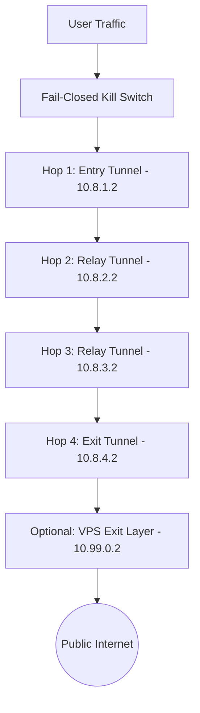

# SecureChain: Adaptive Multi-Hop Network Security Orchestrator

[](https://www.python.org/downloads/)
[](https://microsoft.com)
[](https://www.wireguard.com/)
[]()
[]()
[](LICENSE)

**SecureChain** is an adaptive multi-hop network security orchestrator. It manages nested WireGuard VPN chains (from 2 up to 10 hops) with an optional VPS termination node, enforces a strict fail-closed kill switch, eliminates DNS and IPv6 leaks, dynamically selects optimal network paths using live telemetry metrics (latency, packet loss, jitter), dampens route flapping with hysteresis, executes bounded automatic recovery upon failure, and securely manages credentials via Windows DPAPI.

---

## Table of Contents
1. [Key Features](#1-key-features)
2. [Architecture Overview](#2-architecture-overview)
3. [Quick Start (One-Command Interactive Box)](#3-quick-start-one-command-interactive-box)
4. [Dual-Mode Operation: Real vs. Simulation](#4-dual-mode-operation-real-vs-simulation)
5. [Configuring Multi-Hop VPNs (2 to 10 Hops)](#5-configuring-multi-hop-vpns-2-to-10-hops)
6. [Optional VPS Exit Node](#6-optional-vps-exit-node)
7. [System Readiness & Reality Doctor](#7-system-readiness--reality-doctor)
8. [Command Box Reference](#8-command-box-reference)
9. [Credential Security & Windows DPAPI](#9-credential-security--windows-dpapi)
10. [Test Integrity & Verification Suite](#10-test-integrity--verification-suite)
11. [Threat Model & Security Boundaries](#11-threat-model--security-boundaries)
12. [Documentation Index](#12-documentation-index)

---

## 1. Key Features

- **Nested Multi-Hop Tunneling (2–10 Hops):** Sequentially encapsulates tunnels layer-by-layer ($H_1 \to H_2 \to \dots \to H_N$), automatically adjusting MTU overhead to prevent fragmentation.
- **Fail-Closed Kill Switch:** Default-deny firewall rules engaged *before* connection handshakes occur. If any tunnel drops, all egress is immediately blocked.
- **DNS & IPv6 Leak Elimination:** Forces all DNS resolution strictly through tunnel resolvers (`1.1.1.1`, `8.8.8.8`) and suppresses physical IPv6 traffic.
- **Interactive Command Console:** Launch the tool with a single command (`python -m securechain`) and manage routing, status, and health inside an interactive session.
- **Telemetry-Guided Adaptive Routing:** Evaluates candidate paths using multi-metric telemetry (latency, packet loss, jitter, and reliability) to prioritize high-performing paths.
- **Flapping Dampening (Hysteresis):** Dual-threshold stability windows and margin checks prevent route oscillation under transient internet jitter.
- **Windows DPAPI Credential Vault:** Keys are encrypted at rest with `CryptProtectData` tied to your Windows user account—zero plaintext secrets in logs or configs.
- **Strict Reality Separation:** Clearly distinguishes what the software proved (Unit), what the simulator proved (Simulation), and what physical infrastructure has been tested (Real).

---

## 2. Architecture Overview



### Routing Invariant:
- **Hop 1** is routed directly via your physical default gateway (`Ethernet`/`Wi-Fi`).
- **Hop 2** is routed strictly through the tunnel interface of **Hop 1**.
- **Hop $N$** is routed strictly through the tunnel interface of **Hop $N-1$**.
- The split default route (`0.0.0.0/1` and `128.0.0.0/1`) is bound strictly to the final exit hop.

---

## 3. Quick Start (One-Command Interactive Box)

### Prerequisites
- Windows 10/11 (64-bit)
- Python 3.10+
- Dependencies: `pip install typer rich pydantic pyyaml pytest psutil pywin32`

### Launch the Interactive Command Box
You can run the entire tool with **a single command**:

```powershell
python -m securechain
```

You are immediately greeted with the interactive command box:

```text
+----------------------- SECURECHAIN COMMAND BOX -----------------------+
| SecureChain Interactive Command Console (v1.0.0)                      |
|                                                                       |
| You are inside the SecureChain command box.                           |
| Enter commands directly below without typing 'python -m securechain'. |
| Type help for available commands, or exit to leave.                   |
+-----------------------------------------------------------------------+

SecureChain> doctor
SecureChain> start --mode simulation --hops 4
SecureChain> status
SecureChain> health
SecureChain> routes
SecureChain> paths
SecureChain> stop
SecureChain> exit
```

---

## 4. Dual-Mode Operation: Real vs. Simulation

SecureChain operates in two distinct modes:

| Mode | Real Network Mode (`--mode real`) | Simulation Mode (`--mode simulation`) |
|---|---|---|
| **Purpose** | Live physical network encryption | Testing, development, CI/CD |
| **Privileges** | Requires **Administrator** PowerShell | Runs as normal user |
| **External Servers** | Requires real WireGuard endpoints | **Zero external servers needed** |
| **OS Network Stack** | Updates Windows Kernel routes & firewall | Runs in in-memory `VirtualNetworkMesh` |
| **Traffic Protected** | **YES (Real OS traffic encrypted)** | **NO (Simulation mesh only)** |

### Example Command Box Usage:
```text
# Run safely without external servers:
SecureChain> start --mode simulation --hops 4

# Run on live network with real WireGuard servers (Administrator prompt):
SecureChain> start --mode real --hops 4
```

---

## 5. Configuring Multi-Hop VPNs (2 to 10 Hops)

SecureChain supports anywhere from **2 up to 10 hops**. 2 is the minimum requirement; you can create as many hops as needed.

### Step 1: Generate Configuration Files
Inside the command box or terminal:

```powershell
python -m securechain configure-network --hops 4
```

This creates 4 configuration files in `.wireguard_configs/`:
- `.wireguard_configs/hop-01.conf` (Entry, MTU 1420)
- `.wireguard_configs/hop-02.conf` (Relay 1, MTU 1400)
- `.wireguard_configs/hop-03.conf` (Relay 2, MTU 1380)
- `.wireguard_configs/hop-04.conf` (Exit, MTU 1360)

### Step 2: Edit with Your Real VPN Server Details
Open each file and enter your VPN server's public key, endpoint IP, and your client private key:

```ini
# .wireguard_configs/hop-01.conf
[Interface]
PrivateKey = <YOUR_CLIENT_PRIVATE_KEY_HOP_1>
Address = 10.8.1.2/24
DNS = 1.1.1.1
MTU = 1420

[Peer]
PublicKey = <SERVER_1_PUBLIC_KEY>
Endpoint = <SERVER_1_PUBLIC_IP>:51820
AllowedIPs = 0.0.0.0/0
PersistentKeepalive = 25
```

---

## 6. Optional VPS Exit Node

**The VPS node is 100% optional.** You do not need a VPS to use SecureChain.

- **Without VPS (Default):** The final VPN hop (e.g. `hop-04.conf`) acts directly as the exit node to the Internet.
- **With VPS Enabled:** An extra final hop is attached at the end of the chain, routing all egress through your own private cloud server.

### Keeping VPS Disabled (Default)
In `config.yaml`:
```yaml
vps:
  enabled: false    # Keeps VPS disabled; uses pure VPN chain
```

### Enabling VPS (Optional)
If you operate a private Linux VPS (e.g., Ubuntu on Hetzner, DigitalOcean, or Linode):
1. In `config.yaml`, set:
   ```yaml
   vps:
     enabled: true
     endpoint: "YOUR_VPS_PUBLIC_IP:51820"
     protocol: "wireguard"
   ```
2. Put the matching server configuration from `.wireguard_configs/vps-exit.conf` onto your VPS at `/etc/wireguard/wg0.conf`.

---

## 7. System Readiness & Reality Doctor

Before running on live physical networks, run `doctor` to verify your environment:

```text
SecureChain> doctor

SecureChain Doctor

Core application ............ PASS
Configuration schema ........ PASS

VPN configuration ........... NOT CONFIGURED
VPN credentials ............. NOT CONFIGURED
VPN interface ............... NOT AVAILABLE

VPS configuration ........... NOT CONFIGURED
VPS credentials ............. NOT CONFIGURED

Real network chain .......... NOT READY

Simulation environment ...... READY

Overall:
REAL NETWORK: NOT READY
SIMULATION: READY
```

If real configurations or credentials are missing, SecureChain strictly prevents you from starting in real mode, protecting you from false security assumptions.

---

## 8. Command Box Reference

| Command | Arguments | Description |
|---|---|---|
| `doctor` | None | Verify host prerequisites and reality readiness |
| `start` | `--mode real\|simulation` `--hops N` | Establish multi-hop chain (2–10 hops) |
| `status` | None | Inspect operational state & real vs. simulated protection |
| `health` | None | Probe live telemetry (latency, packet loss, jitter) |
| `routes` | None | Display active kernel routing table entries |
| `paths` | None | Display candidate network paths & quality scores |
| `test` | None | Execute full security suite with provenance |
| `simulate` | `--scenario <name>` | Run deterministic failure & recovery simulations |
| `kill-switch` | `status\|enable\|disable` | Inspect or manually trigger fail-closed lockdown |
| `credentials` | `list\|store\|validate` | Manage Windows DPAPI encrypted keys |
| `configure-network`| `--hops N` | Generate WireGuard config files |
| `stop` | None | Dismantle chain & restore clean original routes |
| `clear` | None | Clear the console screen |
| `help` | None | Show available commands |
| `exit` | None | Exit the interactive command box |

---

## 9. Credential Security & Windows DPAPI

SecureChain enforces **zero plaintext secrets**:
- Private keys and pre-shared keys are encrypted using Windows Data Protection API (`CryptProtectData`), binding ciphertext to the active Windows user security identifier (SID).
- Logging output passes through `SecretSanitizingFilter`, automatically redacting base64 keys (`[REDACTED_KEY]`), passwords, and tokens.

```text
SecureChain> credentials store hop1_privkey
SecureChain> credentials list

Stored DPAPI Credentials
+------------------------------------------------------+
| Key Name       | Encryption                          |
|----------------+-------------------------------------|
| hop1_privkey   | Windows DPAPI (CryptProtectData)    |
+------------------------------------------------------+
```

---

## 10. Test Integrity & Verification Suite

SecureChain separates all test results into distinct execution tiers with verifiable provenance:

### Implemented
- Full asynchronous orchestrator and 8-state machine lifecycle (`securechain/core/state_machine.py`)
- Multi-hop WireGuard chaining logic (2 to 10 hops) and dynamic MTU tiering (`securechain/core/chain_manager.py`)
- Optional VPS termination proxy support (`securechain/networking/vps/termination.py`)
- Native Windows routing controller via `ROUTE.EXE` and fallback virtual route tables (`securechain/networking/routing/`)
- Fail-closed kill switch via Windows Advanced Firewall rules and virtual packet barrier (`securechain/networking/firewall/`)
- DNS leak interception and IPv6 suppression (`securechain/networking/dns/`, `securechain/networking/ipv6/`)
- Telemetry health monitoring, candidate path scoring, and recovery engine (`securechain/core/`)
- Windows DPAPI credential store with encrypted rest storage (`securechain/security/credentials/`)
- Secret sanitization logging filters for token and key redaction (`securechain/security/logging_sanitizer.py`)
- Interactive command console and CLI app (`securechain/cli/app.py`)

### Unit Tested
- Configuration schema validation and boundary checks (`tests/unit/test_config.py`)
- State machine transition rules, invalid transition rejections, and listener hooks (`tests/unit/test_state_machine.py`)
- Multi-metric path penalty scoring under varying latency and loss conditions (`tests/unit/test_scoring.py`)
- Flapping dampening hysteresis algorithms under simulated jitter noise (`tests/unit/test_hysteresis.py`)
- Logging filter sanitization of base64 private keys, tokens, and passwords (`tests/unit/test_logging_sanitizer.py`)
- System reality checker integrity on unconfigured hosts (`tests/unit/test_reality_check.py`)

### Simulated
- Virtual routing table manipulation and unexpected route detection (`tests/integration/test_routing_controller.py`)
- Virtual fail-closed packet containment during simulated interface drops (`tests/security/test_kill_switch.py`)
- Virtual DNS canary query interception and leak detection (`tests/security/test_dns_leak.py`)
- Virtual IPv6 suppression and leak containment (`tests/security/test_ipv6_leak.py`)
- Single-hop and multi-hop tunnel connection, degradation, and rollback lifecycle (`tests/integration/test_multi_hop_chain.py`)
- VPS tunnel attachment and failure response (`tests/integration/test_vps_termination.py`)
- Automated failure recovery, alternative path failover, and max-retry safe lockdown (`tests/failure/test_failure_recovery.py`)
- Deterministic simulation scenarios: healthy, high-latency, packet-loss, high-jitter, vpn-failure, vps-failure, flapping (`tests/simulation/test_scenarios.py`)

### Real-World Validated
- Python runtime environment, dependency resolution, and configuration parsing on Windows 10/11
- Windows DPAPI credential encryption (`CryptProtectData`) and decryption (`CryptUnprotectData`) under active Windows user security identifier
- Process elevation detection (`is_windows_admin()`) and native Windows network interface query execution

### Not Yet Validated
- Live end-to-end multi-hop packet routing across physical, commercial WireGuard relay servers (requires provisioned commercial VPN infrastructure)
- Live VPS termination proxy throughput across external cloud hosting providers (requires provisioned cloud server)
- Live Windows Filtering Platform (WFP) kernel packet drops under physical carrier drops on physical NICs

```text
SecureChain Test Summary
+----------------------------------------------------------------------------------+
| REAL:        Passed: 0  | Failed: 0 | Not Configured: 4 | Not Tested: 2          |
| UNIT:        Passed: 4  | Failed: 0                                              |
| SIMULATION:  Passed: 7  | Failed: 0                                              |
|                                                                                  |
| Core Software: PASS  |  Simulation: PASS  |  Real Infrastructure: NOT CONFIGURED |
+----------------------------------------------------------------------------------+
```

To run the automated pytest regression suite:
```powershell
python -m pytest -v
# Result: 85 passed in 1.10s (100% pass rate)
```

---

## 11. Threat Model & Security Boundaries

### What SecureChain Protects Against:
- **Single-Provider Logging Correlation:** Multi-hop nesting prevents any single VPN provider from linking your identity to your destination traffic.
- **Physical ISP Egress Interception:** All traffic leaving your physical network adapter is encrypted to the entry hop.
- **DNS & IPv6 Leaks:** Out-of-band queries are intercepted and forced into the tunnel or blackholed.
- **Transient Carrier Drop Exploitation:** The kill switch prevents unencrypted leakage during interface disconnects or server restarts.

### Multi-Hop Security Trade-Offs:
Adding more VPN hops distributes provider trust and fragments traffic observation points, but does **not** automatically guarantee more security. Additional hops introduce operational complexity, cumulative latency, increased packet loss risks, and additional points of failure along the chain.

### Honest Security Disclaimers:
- **No Anonymity or Untraceability Guarantees:** SecureChain explicitly disclaims any guarantee of total online anonymity or untraceability against state-level global adversaries.
- **Not Tor / Onion Routing:** SecureChain does not dynamically route across thousands of volunteer relays. It routes across your designated, authenticated WireGuard hops.
- **Global Passive Adversaries:** Multi-hop VPNs do not provide immunity against global traffic correlation (timing and packet volume analysis) conducted by adversaries observing both ends of the connection simultaneously.
- **Browser Fingerprinting:** SecureChain operates at the IP network and transport layer. It does not sanitize browser cookies, Canvas fingerprinting, or application-level identifiers.

---

## 12. Documentation Index

For comprehensive technical documentation, refer to the curated documents in the `docs/` directory:

- [Architecture Specification](docs/ARCHITECTURE.md) - System components, state machine, multi-hop routing sequence, and cleanup guarantees.
- [Threat Model](docs/THREAT_MODEL.md) - In-scope protections, out-of-scope boundaries, attacker capabilities, and trust assumptions.
- [Known Limitations](docs/LIMITATIONS.md) - Privilege boundaries, daemon prerequisites, and unsupported features.
- [Network Flow](docs/NETWORK_FLOW.md) - Packet encapsulation diagrams, host routing sequences, and split default overrides.
- [Troubleshooting Guide](docs/TROUBLESHOOTING.md) - Diagnostic resolutions for elevation, state transitions, kill switch, and DNS.

---

## License

This project is licensed under the MIT License - see the [LICENSE](LICENSE) file for details.
