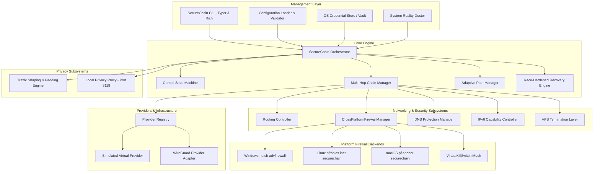
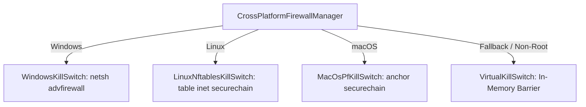

# SecureChain Architecture Specification

## 1. Executive Summary
SecureChain is a dynamic multi-hop network security orchestrator designed to coordinate layered VPN tunnels, an optional VPS termination node, dynamic routing tables, DNS resolvers, and firewall containment barriers across multiple operating systems.

The orchestrator explicitly distinguishes:
- **Traffic Confidentiality**: Cryptographic encapsulation of payloads at each hop.
- **Tunnel Security**: Mutual authentication and session key isolation between hops.
- **Routing Isolation**: Layered host routes ensuring that each tunnel payload is transmissible strictly via the immediately preceding tunnel interface.
- **Leak Prevention**: Complete containment of DNS requests and IPv6 traffic with capability-aware routing.
- **Cross-Platform Firewall Enforcement**: Native firewall barriers for Windows (`netsh`), Linux (`nftables`), and macOS (`pf`) inside isolated namespaces.
- **Availability & Resilience**: Adaptive telemetry-based path selection and race-hardened recovery.
- **Traffic Analysis Reduction**: Optional packet-size bucket padding and timing jitter.
- **Anonymity Boundaries**: Explicitly disclaimed. Multiple VPN hops do not guarantee untraceability against global passive adversaries.

---

## 2. Core System Components

---

## 3. Explicit State Machine & Transitions

### 3.1 States
- `OFFLINE`: System is idle. Physical network untouched.
- `INITIALIZING`: Pre-flight checks, credential retrieval, routing table snapshot.
- `BUILDING_CHAIN`: Allocating candidate hops and configuring routing sequence.
- `CONNECTING`: Activating tunnel interfaces sequentially under lockdown.
- `VERIFYING`: Executing end-to-end ping, DNS resolution test, and IPv6 capability verification.
- `PROTECTED`: All verification checks passed. Kill switch transitions to `FILTERED_PASS`.
- `DEGRADED`: Chain operational but experiencing elevated latency, jitter, or loss.
- `FAILURE_DETECTED`: Tunnel loss or leak detected.
- `TRAFFIC_BLOCKED`: Kill switch instantly locked down. All direct physical egress blocked.
- `RECOVERING`: Synchronized, mutex-protected recovery attempting in-place reconnect or alternative path failover.
- `REBUILDING_ROUTE`: Updating host routes and split default routes for new path.
- `RECOVERY_FAILED`: Max retries exhausted or no healthy candidates available.
- `TRAFFIC_REMAINS_BLOCKED`: Terminal safe state. System maintains permanent fail-closed block.
- `SHUTTING_DOWN`: Graceful teardown initiated.
- `DISCONNECTED`: Original system routes, DNS, and firewall restored cleanly.

---

## 4. Multi-Hop Routing & IPv6 Capability Architecture

### 4.1 IPv4 Layered Routing Sequence
For $N$ hops (where $2 \le N \le 10$):
1. **Hop 1 Endpoint ($E_1$)**: Host route added via physical default gateway ($GW_0$). Interface $T_1$ created. Kill switch allows outbound UDP handshake to $E_1:P_1$.
2. **Hop 2 Endpoint ($E_2$)**: Host route added via Hop 1 interface gateway ($GW_1$). Interface $T_2$ created.
3. **Hop $i$ Endpoint ($E_i$)**: Host route added via Hop $i-1$ interface gateway ($GW_{i-1}$). Interface $T_i$ created.
4. **Final Hop IPv4 Split Default Override**:
   - `0.0.0.0/1` via $GW_N$ (or VPS endpoint)
   - `128.0.0.0/1` via $GW_N$ (or VPS endpoint)
   These more-specific routes direct all traffic into the tunnel without destroying baseline physical default gateway routes.

### 4.2 Per-Hop IPv6 Capability Detection & Routing
Before establishing IPv6 routing, SecureChain inspects the `supports_ipv6` attribute across every connected hop:
- **All-IPv6 Capable Chain** ($H_1 \dots H_N$ all `supports_ipv6 = True`):
  - IPv6 controller sets status to `TUNNELED`.
  - Split default IPv6 routes are added: `::/1` and `8000::/1` via exit tunnel gateway ($GW_N$).
  - WireGuard configuration includes `AllowedIPs = 0.0.0.0/0, ::/0`.
- **Mixed or IPv4-Only Chain** (Any hop has `supports_ipv6 = False`):
  - IPv6 controller enforces `BLOCKED_FAIL_CLOSED`.
  - No IPv6 routes are added to the tunnel.
  - Physical adapter IPv6 is suppressed to prevent side-channel leakage.
  - Diagnostic reason is populated: `"IPv6 disabled: Hop X does not support IPv6. External IPv6 blocked."`

---

## 5. Cross-Platform Firewall Architecture

SecureChain abstracts firewall management across platforms through `CrossPlatformFirewallManager`:

### 5.1 Isolation Invariants
- **Linux (`nftables`)**: All rules reside strictly within `table inet securechain`. Teardown executes `nft delete table inet securechain`. System tables, Docker chains, and user rules are never flushed.
- **macOS (`pf`)**: All rules reside strictly within `anchor "securechain"`. Teardown executes `pfctl -a securechain -F all`. Host rules outside the anchor are untouched.
- **Windows (`netsh`)**: Specific named rules (`SecureChain-BlockOutbound`, `SecureChain-AllowHop1`, `SecureChain-AllowExit`) are managed.

---

## 6. Privacy & Traffic Shaping Subsystems

### 6.1 Traffic Shaping Engine
- **Purpose**: Reduce observable packet clustering and burst timing signatures.
- **Padding Strategies**:
  - `bucket`: Quantizes packet sizes to discrete bins (128B, 256B, 512B, 1024B, 1420B).
  - `adaptive`: Power-of-two quantization up to MTU.
  - `fixed_mtu`: Pads all packets to tunnel MTU.
- **Timing Jitter**: Injects bounded pseudo-random delays based on selected profile (low, balanced, high).
- **Disclaimer**: Does not defeat global passive timing correlation.

### 6.2 Application Privacy Proxy
- **Interface**: Local HTTP proxy listening on `127.0.0.1:8118`.
- **Header Normalization**: Strips identifying headers (`X-Forwarded-For`, `X-Real-IP`, `Via`, `CF-Connecting-IP`, `Client-IP`).
- **User-Agent Normalization**: Standardizes User-Agent to a generic baseline.
- **TLS Pass-Through**: Transparent `CONNECT` method handling with zero TLS MITM interception.

---

## 7. Race-Hardened Failure Recovery

`RecoveryEngine` synchronizes failure handling via a thread-safe mutex (`_recovery_lock`):
1. **Atomic Containment**: Lock prevents concurrent recovery threads from racing during failure events.
2. **In-Place Reconnect**: Tunnels are re-evaluated and re-connected up to `max_attempts`.
3. **Alternative Path Failover**: If in-place recovery fails, the old chain is torn down, stale routes are purged, and an alternative candidate is connected under continuous kill switch lockdown.
4. **Terminal Safe State**: If all retries fail, system locks into `TRAFFIC_REMAINS_BLOCKED` and rejects subsequent recovery calls until manual restart.
