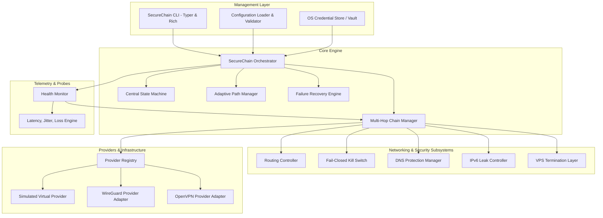

# SecureChain Architecture Specification

## 1. Executive Summary
SecureChain is a dynamic multi-hop network security orchestrator designed to coordinate layered VPN tunnels, an optional VPS termination node, dynamic routing tables, DNS resolvers, and firewall containment barriers.

The orchestrator explicitly distinguishes:
- **Traffic Confidentiality**: Cryptographic encapsulation of payloads at each hop.
- **Tunnel Security**: Mutual authentication and session key isolation between hops.
- **Routing Isolation**: Layered host routes ensuring that each tunnel payload is transmissible strictly via the immediately preceding tunnel interface.
- **Leak Prevention**: Complete containment of DNS requests and IPv6 traffic.
- **Availability**: Adaptive telemetry-based path selection and automatic recovery.
- **Anonymity**: Explicitly disclaimed. Multiple VPN hops do not guarantee untraceability against global adversaries.

---

## 2. Core System Components

---

## 3. Explicit State Machine

### 3.1 States
- `OFFLINE`: System is idle. Physical network untouched.
- `INITIALIZING`: Pre-flight checks, credential retrieval, routing table snapshot.
- `BUILDING_CHAIN`: Allocating candidate hops and configuring routing sequence.
- `CONNECTING`: Activating tunnel interfaces sequentially.
- `VERIFYING`: Executing end-to-end ping, DNS resolution test, and IPv6 leak check.
- `PROTECTED`: All verification checks passed. Kill switch releases normal traffic into chain.
- `DEGRADED`: Chain operational but experiencing elevated latency, jitter, or loss. Path evaluation triggered.
- `FAILURE_DETECTED`: Tunnel loss or leak detected.
- `TRAFFIC_BLOCKED`: Kill switch instantly activated. All non-tunnel traffic dropped.
- `RECOVERING`: Attempting in-place reconnect or candidate path switch.
- `REBUILDING_ROUTE`: Updating host routes and split default routes for new path.
- `RECOVERY_FAILED`: Max retries exhausted or no healthy candidates available.
- `TRAFFIC_REMAINS_BLOCKED`: Terminal safe state. System will not release unverified traffic.
- `SHUTTING_DOWN`: Graceful teardown initiated.
- `DISCONNECTED`: Original system routes and DNS restored cleanly.

### 3.2 State Transition Matrix
| Current State | Event | Target State | Action |
|---|---|---|---|
| `OFFLINE` | `start()` | `INITIALIZING` | Snapshot routes, load config |
| `INITIALIZING` | `init_success` | `BUILDING_CHAIN` | Prepare hop endpoints |
| `INITIALIZING` | `init_failure` | `OFFLINE` | Cleanup, report error |
| `BUILDING_CHAIN`| `chain_ready` | `CONNECTING` | Engage Kill Switch, start hop 1 |
| `CONNECTING` | `hop_connected` | `CONNECTING` / `VERIFYING` | Sequential hop chaining |
| `CONNECTING` | `connect_failed` | `TRAFFIC_BLOCKED` | Trigger recovery |
| `VERIFYING` | `verify_passed` | `PROTECTED` | Release protected traffic |
| `VERIFYING` | `verify_failed` | `TRAFFIC_BLOCKED` | Maintain barrier |
| `PROTECTED` | `metric_degraded`| `DEGRADED` | Evaluate alternative paths |
| `PROTECTED` | `tunnel_dropped`| `FAILURE_DETECTED` | Signal kill switch immediately |
| `DEGRADED` | `tunnel_dropped`| `FAILURE_DETECTED` | Signal kill switch immediately |
| `DEGRADED` | `metric_restored`| `PROTECTED` | Return to nominal state |
| `FAILURE_DETECTED` | `contain` | `TRAFFIC_BLOCKED` | Block all outbound non-tunnel traffic |
| `TRAFFIC_BLOCKED` | `recover` | `RECOVERING` | Evaluate retries/candidates |
| `RECOVERING` | `reconnected` | `REBUILDING_ROUTE`| Reconfigure layer routes |
| `RECOVERING` | `retries_exhausted` | `RECOVERY_FAILED` | Safe terminal block |
| `RECOVERY_FAILED`| `lock` | `TRAFFIC_REMAINS_BLOCKED` | Alarm raised |
| `REBUILDING_ROUTE`| `routes_ready` | `VERIFYING` | Comprehensive verification |
| `*` (Any State) | `stop()` | `SHUTTING_DOWN` | Revert routes, firewall, DNS |
| `SHUTTING_DOWN` | `teardown_done` | `DISCONNECTED` | Verify clean state |

---

## 4. Multi-Hop Routing Mechanics

For $N$ hops (where $2 \le N \le 10$):
1. **Hop 1 Endpoint ($E_1$)**: Host route added via physical default gateway ($GW_0$). Interface $T_1$ created.
2. **Hop 2 Endpoint ($E_2$)**: Host route added via Hop 1 interface gateway ($GW_1$). Interface $T_2$ created.
3. **Hop $i$ Endpoint ($E_i$)**: Host route added via Hop $i-1$ interface gateway ($GW_{i-1}$). Interface $T_i$ created.
4. **Final Hop Default Override**: Rather than overwriting physical $0.0.0.0/0$, SecureChain adds two more-specific routes:
   - `0.0.0.0/1` via $GW_N$ (or VPS endpoint)
   - `128.0.0.0/1` via $GW_N$ (or VPS endpoint)
   This guarantees that all internet traffic traverses the final tunnel while physical gateway routes remain intact for instant, deterministic teardown.

---

## 5. Failure Containment & Cleanup Guarantee

### 5.1 Pre-Flight Route Snapshot
Before modifying any route, `RoutingController` captures:
- Full routing table (destination, netmask, gateway, interface, metric).
- Primary DNS resolvers per adapter.
- IPv6 adapter binding status.
A snapshot is stored in memory and retained for state rollback.

### 5.2 Deterministic Teardown
On `stop()`, unexpected exception, or `SIGINT`/`SIGTERM`:
1. Kill switch is locked to block direct leakage.
2. Tunnel interfaces $T_N \dots T_1$ are stopped in reverse order.
3. Host routes $E_N \dots E_1$ and split `/1` default routes are deleted.
4. Pre-flight snapshot is cross-referenced; any missing default routes are restored.
5. DNS servers are restored to snapshot values.
6. IPv6 bindings are restored.
7. Kill switch rules are safely removed once original state is verified.

---

## 6. Operating System Abstraction Strategy
- **Target OS**: Windows (with cross-platform abstraction architecture).
- **Native Implementation**: Uses `ROUTE.EXE`, `netsh.exe`, Windows Filtering Platform / Advanced Firewall cmdlets, and Windows DPAPI (`CryptProtectData`/`CryptUnprotectData`).
- **Virtual Simulation Mesh**: Built-in virtual packet barrier, virtual route table, synthetic DNS resolvers, and deterministic telemetry models. This enables full integration and security verification in un-elevated environments and CI/CD pipelines without external dependencies.
